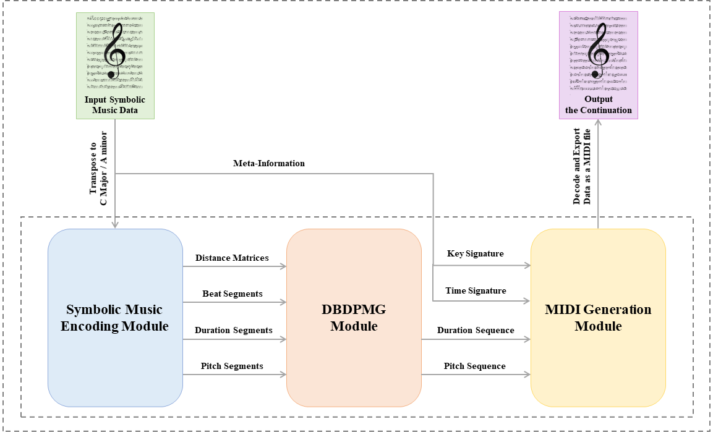

This webpage is the homepage of the MuseRNN as described in the article "A Distance and Beat-aware Duration and Pitch Mutual Generation Model for Instrumental Music" which submitted to ACM TOMM 2021 (submission ID XXXX).

    MuseRNN is a model on music generation. Based on the duration and pitch information, MuseRNN is provided with more comprehensive musical information by introducing distance and beat information. In addition, benefitting from the adaptive temperature sampling, the model achieves the generation of complete musical compositions with a distinct structure as well as a sense of beat.

## Model

MuseRNN is a Distance and Beat-aware Duration and Pitch Mutual Generation (DBDPMG) model that can be applied to instrumental music generation. MuseRNN predicts the duration and pitch of notes by automatically computing the distance matrix for each note and the corresponding beat information while making full use of the meta-information contained in symbolic music data. In addition, the model avoids the degeneration problem that often occurs in sequence generation tasks while maintaining the generation fidelity. Specifically, MuseRNN consists of three modules: Symbolic Music Encoding Module, DBDPMG Module, and MIDI Generation Module.

    

    Symbolic Music Encoding Module encoding the symbolic music data, extracting the duration and pitch of each note, as well as the meta-information of the score (key signature, and time signature). The module automatically computes the distance matrix and beat sequence to assist the model in understanding the distribution of notes in a piece of music, so as improve the quality of the generated music.

    

    DBDPMG Module adopting a multi-task learning framework to generate the duration and pitch of each note separately. Through the distance matrix and beat sequence, the DBDPMG module learns from this auxiliary information about how to generate a complete musical composition with a clear structure and a sense of beat. The module uses the adaptive temperature sampling method to ensure the quality of the generated music while avoiding the degeneration problem.

    

    MIDI Generation Module decoding the duration sequence and the pitch sequence generated by the DBDPMG module, then combining them as the melody sequence, and finally outputting the music in MIDI format. Unlike other models that only pre-process the key into C major/A minor, the MIDI Generation module re-transposes the piece from C major/A minor back to its original key. As a result, MuseRNN maintains a consistent generation quality in any given key.

    

## Dataset

East Asian music, Chinese music in particular, not only has a distinctive style due to its use of pentatonic tonality, but also has accumulated a large number of pieces of music that have been handed down to the present day in its long history. The self-built dataset China-MIDI used in this experiment contains 2,708 traditional Chinese instrumental pieces (consisting of a total of 210,326 notes) in MIDI format. With a default tempo setting of bpm=60, the total playing time of all the pieces in the dataset is approximately 34.8 hours.

    Statistics on the musical information of the China-MIDI dataset are given in the figure shown below. For presentation purposes, key signatures are expressed as the number of sharps, while note pitches are expressed as the corresponding MIDI pitches (rest is 0), and chords are split into separate notes. The China-MIDI dataset is scheduled to be published in the near future, to bring more types of music data to the field of music generation.

    

    Some excerpts from the score are shown below.

    

    
    

    
    

## Experiments

We used the self-built dataset China-MIDI to train our model. We analysed and compared the music generated by MuseRNN and previous methods, and conducted online listener experiments to validate the effectiveness of our model. Two music generation models were selected as baselines for the objective and subjective experiments: [Melody RNN](https://github.com/magenta/magenta/tree/master/magenta/models/melody_rnn) (RNN), a model proposed by Google Magenta, is based on RNN networks using a language modelling approach to generate melodies; [MidiNet](https://github.com/RichardYang40148/MidiNet/tree/master/v1) (GAN), a CNN-GAN-based MIDI generation model, which uses conditional mechanism to exploit versatile prior knowledge of music.

    All participants were first surveyed to give information about their musical backgrounds. They could choose group which fits them best as follows: 1) Musical Background I: I rarely listen to traditional Chinese music. 2) Musical Background II: I’m a traditional Chinese music amateur. 3) Musical Background III: I’m a music major. In this experiment, a total of 146 participants took this test: 71 from Musical Background I, 44 from Musical Background II, and 31 from Musical Background III.

    In this test, participants were asked to make a binary judgement based on the audio: 1) the music is generated by artificial intelligence, and 2) the music is genuine traditional Chinese music. Before the test, participants were told that the first half of all the audio was excerpted from traditional Chinese music, and they needed to pay attention to whether the second half was similar to the first half in order to determine whether it was of the same origin. However, they were not informed that how many of the second half of the audio was generated by models.

    The figure shown below shows the distribution of votes for each model. Overall, the following phenomena can be observed: 1) the higher the musical background of the participants, the lower their error rate, and 2) the more complex the model, the higher its support rate (error rate) from the participants. Participants had the highest average support rate on the DBDPMG model, reaching 63.01% and well above the level of the rest baseline models. This suggests that by making full use of the information within the score, the music generated by MuseRNN has reached a level where it is difficult to distinguish from human-composed music. Furthermore, the three worst-performing models were the BDPMG model, MidiNet, and Melody RNN. The most obvious feature of the music generated by these models was that it has no coda. This phenomenon implies that participants rely on the presence or absence of a distinct sense of coda in the piece as the main basis for judgement.

    

## Samples

The experiments in this paper perform a music continuation task on the validation set to verify the performance ofthe MuseRNN. Specifically, each piece of music in the validation set is cut equally into two segments of equal length, and the model is asked to output the complete piece of music by continuing the first half.

    The MIDI files were rendered using the Guzheng soundfont from GarageBand, and all scores were uniformly performed at the default tempo (bpm=60) and velocity (velocity=90). Thus, we can focus on the differences in the contents of scores without being distracted by the performing style.

    One of the music samples in the validation set is shown below, which is an 8-bar sample of traditional Chinese music.

    <audio id="audio" controls="" preload="none">
    <source id="wav" src="Origin.wav">
    </audio>

    

    Each participant was asked to complete six listening questions, corresponding to six different music generation models. During the test, participants were allowed to play the audio an unlimited number of times.

### DBDPMG

    <audio id="audio" controls="" preload="none">
    <source id="wav" src="DBDPMG.wav">
    </audio>

    

  

### BDPMG

    <audio id="audio" controls="" preload="none">
    <source id="wav" src="BDPMG.wav">
    </audio>

    

  

### DDPMG

    <audio id="audio" controls="" preload="none">
    <source id="wav" src="DDPMG.wav">
    </audio>

    

  

### DBDPG

    <audio id="audio" controls="" preload="none">
    <source id="wav" src="DBDPG.wav">
    </audio>

    

  

### MidiNet

    <audio id="audio" controls="" preload="none">
    <source id="wav" src="MidiNet.wav">
    </audio>

    

  

### Melody RNN

    <audio id="audio" controls="" preload="none">
    <source id="wav" src="Melody RNN.wav">
    </audio>

    

  

    More code and dataset will be avaliable soon. :)

